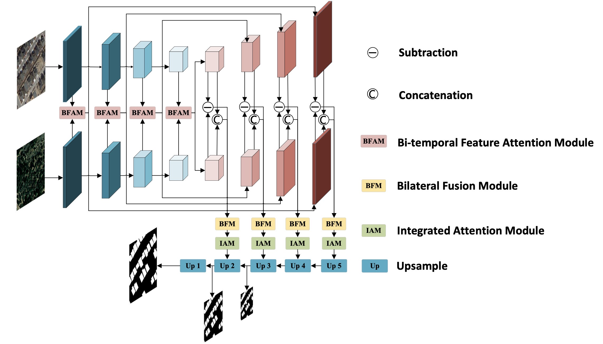

## AMFNet: Attention-Guided Multi-Scale Fusion Network for Bi-Temporal Change Detection in Remote Sensing Images

The official pytorch implementation of the paper **[AMFNet: Attention-Guided Multi-Scale Fusion Network for Bi-Temporal Change Detection in Remote Sensing Images](https://www.mdpi.com/2072-4292/16/10/1765)**

#### Zisen Zhan, Hongjin Ren, Min Xia\*, Haifeng Lin, Xiaoya Wang, Xin Li

>Change detection is crucial for evaluating land use, land cover changes, and sustainable development, constituting a significant component of Earth observation tasks. The difficulty in extracting features from high-resolution images, coupled with the complexity of image content, poses challenges for traditional change detection algorithms in terms of accuracy and applicability. The recent emergence of deep learning methods has led to substantial progress in the field of change detection. However, existing frameworks often involve the simplistic integration of bi-temporal features in specific areas, lacking the fusion of temporal information and semantic details in the images. In this paper, we propose an attention-guided multi-scale fusion network (AMFNet), which effectively integrates bi-temporal image features and diverse semantics at both the encoding and decoding stages. AMFNet utilizes a unique attention-guided mechanism to dynamically adjust feature fusion, enhancing adaptability and accuracy in change detection tasks. Our method intelligently incorporates temporal information into the deep learning model, considering the temporal dependency inherent in these tasks. We decode based on an interactive feature map, which improves the model’s understanding of evolving patterns over time. Additionally, we introduce multi-level supervised training to facilitate the learning of fused features across multiple scales. In comparison with different algorithms, our proposed method achieves F1 values of 0.9079, 0.8225, and 0.8809 in the LEVIR-CD, GZ-CD, and SYSU-CD datasets, respectively. Our model outperforms the SOTA model, SAGNet, by 0.69% in terms of F1 and 1.15% in terms of IoU on the LEVIR-CD dataset, by 2.8% in terms of F1 and 1.79% in terms of IoU on the GZ-CD dataset, and by 0.54% in terms of F1 and 0.38% in terms of IoU on the SYSU-CD dataset. The method proposed in this study can be applied to various complex scenarios, establishing a change detection method with strong model generalization capabilities.


 

### News
**2024.06.20** The Baseline, including the pretrained models and code, are available now.You can download our pretrained weights through [here](https://pan.baidu.com/s/1U8m3wEhr0LbMYbC9CJ2Ncw?pwd=u0ih)

**2024.05.13** Our [paper](https://www.mdpi.com/2072-4292/16/10/1765) is accepted by **[Remote Sesning](https://www.mdpi.com/journal/remotesensing)** (Impact Factor=4.2)


## Usage
Prepare the dataset according to the requirements mentioned in the Paper.The experimental environment is as follows.

```python
python 3.9.5
pytorch 1.11.0
cuda 11.3
```
## Train
After changing the data path in the training code
```
python train_aux.py
```
## Test
```
python predict_visualization/predict_batch_red&green.py
```
The final model used in the experiment is located in attrition_models/xiaorong.aux.py. The visualization results in the paper are as follows:


 

If you have any questions or ideas, please feel free to contact us micheal013113@gmail.com.
